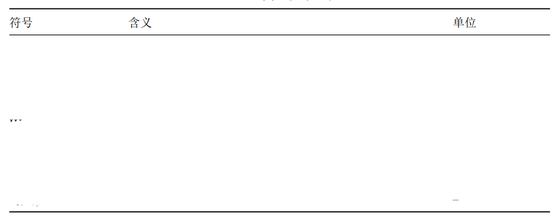
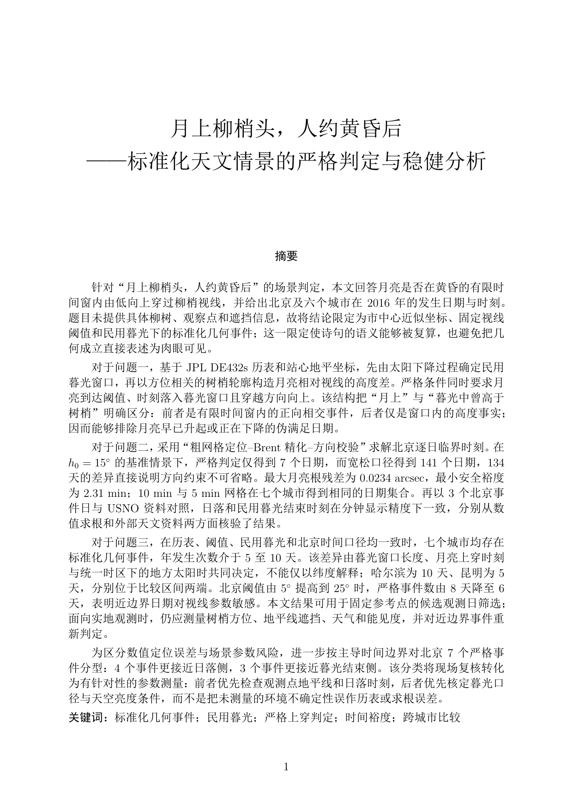

<p align="center">
  
</p>

<h1 align="center">数学建模 Skills</h1>

<p align="center">
  面向高教社杯 / CUMCM 风格竞赛的数学建模 skill 包：把题面理解、建模、复现、图表、摘要、排版和最终审查连接到同一条证据链。
</p>

<p align="center">
  交流与反馈：QQ 1067411335（添加时请注明来意）
</p>

<p align="center">
  
  
  
  
  
  
</p>

---

## 定位

这不是一个固定工作流，也不是论文模板集合。它是一组按事件触发的数学建模专业 skill，设计目标是在数模项目里随叫随用、少打扰、不被固定流程绑架：需要题面、建模、代码、图表、审查或排版时再介入，完成证据整理或风险提示后把判断权交还给人。

它重点放在：

- 题目交付物是否真的被回答；
- 模型、公式、代码、图表、摘要和提交包是否可追溯；
- 数字、单位、场景、结论和图表是否一致；
- 结果是否经过真实数据 PoC、数值诊断、审查 pass items 和最终门禁。

skill 内部可以使用英文技术术语、字段名、算法名和官方规则原文；论文正文、项目清单、复现说明等交付文件默认采用中文竞赛文风。产出以交付文件和人的判断为准：该英文就用英文，不因中文化牺牲技术准确性。

## 人的角色

这个 skill 包的核心假设是：AI 负责把证据链、检查项和可复现材料组织好，人负责判断题意、选择路线、确认取舍、解释结果并承担最终提交责任。

具体来说，人的作用包括：

- **定方向**：判断题目真正要交付什么，决定主线模型和可接受的简化边界。
- **做取舍**：在评价类、机理类、预测类、优化类方案之间选择最适合赛题的路线，而不是让算法名自动决定论文结构。
- **验事实**：确认数据来源、单位、约束、参数和官方规则是否符合真实赛题。
- **审表达**：判断摘要、图表、三线表和模型评价是否能被评委快速核查，而不是只看文本是否流畅。
- **负责任**：AI 可以提供候选、检查和修复建议，但最终采用什么结论、如何披露 AI 使用、哪些内容进入提交包，必须由人确认。

因此，这套 skills 更像一个审查和生产的专业框架：它降低遗漏和漂移风险，但不替代参赛者的建模判断、学术责任和最终决策。

## 效果示例

下面是表格资产的成品参考。README 中展示的是三线表效果示例，实际使用时仍需结合 `figure_evidence.csv`、`result_registry.csv` 或表格来源记录来保证证据可追溯。

<p align="center">
  
</p>

## 一小时临时论文示例

仓库附有一篇[《月上柳梢头，人约黄昏后：标准化天文情景的严格判定与稳健分析》](assets/readme/sample-paper-unoptimized.pdf)。该示例仅展示在正确使用本仓库提示词的情况下，约一小时内临时形成的论文文本；当时未单独整理或优化代码与图表，也没有按完整竞赛交付标准逐项打磨和验收。因此，它不代表本 skill 包的完整工作流或最终成品质量，也不构成对竞赛成绩和通用效果的承诺。

<p align="center">
  <a href="assets/readme/sample-paper-unoptimized.pdf">
    
  </a>
</p>

## 能力亮点

- **证据优先**：每个论文结论必须能追到 claim、result、figure、run、diagnostics 或 verification 记录。
- **真实数据 PoC**：计算路线进入 `paper_ready` 前，需要有不超过 30 行的真实数据 PoC 或等价命令记录。
- **数字冻结**：已被论文引用的 `paper_ready` 数字不能原地手改，必须通过 supersession 和 freeze change log。
- **图表升级门**：图不是画出来就进论文，必须有 claim、来源、图注、图后结论、风险边界和最终尺寸视觉检查。
- **审查可落盘**：最终审查不能只写“已检查”，需要至少 5 条带文件、位置、数值、约束方向和观测证据的 pass items。
- **随叫随用**：不强制 G1-G6 大流程，不新增庞大调度链；需要哪个环节，就调用哪个 skill，减少对比赛现场节奏的打扰。

## 近期更新

- **`math-hub` / `math-model` 更新**：hub 以轻量质量枢纽方式锁定交付物、证据、合规和下一模块；model 在建模、代码交接前明确变量、单位、验证层级、鲁棒性计划和降级规则。
- **`math-problem-reader` 更新**：在建模前锁定题意、附件、依赖关系和分问交付物，避免在题面或数据边界不清时直接选模型。
- **`math-figure` 更新**：以“结论—来源—图注—图后结论—验证状态”为主线选择和审查图表；新增正式论文图表样式、可复用绘图辅助函数，以及高影响力图表资产索引。主图默认无图内标题、优先矢量导出，并在进入正文前完成最终尺寸可读性检查。
- **`math-literature` 更新**：用于文献与权威来源检索、元数据与 DOI/BibTeX 核验，以及 claim-to-citation 映射；来源约束会返回 hub QC，避免事后为了既定模型反向拼接引用。

## 设计来源

这个包沉淀自多轮优秀论文拆解、开源 skill 对照、图表资产改造和实战复盘。保留的是竞赛现场最有用的部分：题面锁定、证据登记、数值复现、图表审查、摘要约束、规则合规和最终提交门禁。

## 经验覆盖与优势

这个 skill 包不是单纯把算法名整理成清单，而是从多篇优秀论文、公开案例和实战复盘中抽出可复用的“题型-证据-表达”结构。重点覆盖：

| 方向 | 关注点 | 本包的处理方式 |
| --- | --- | --- |
| 评价类问题 | 指标体系、权重、排序稳定性、方案优选 | 强制区分指标方向、标准化、权重敏感性和排名翻转风险，避免只套 AHP/TOPSIS 名字 |
| 机理类问题 | 物理/几何/业务机制、约束来源、边界条件 | 先锁定变量、单位、守恒或判定逻辑，再进入公式、仿真或优化实现 |
| 预测类问题 | 训练验证划分、误差传播、预测区间、决策影响 | 不只报告 RMSE，而要求说明预测误差如何影响后续配置、调度或鲁棒决策 |
| 优化与调度类问题 | 决策变量、约束、基准方案、可行性和求解稳定性 | 要求真实数据 PoC、run 记录、数值诊断、结果登记和可复现命令 |
| 论文表达与审查 | 摘要、图表、三线表、模型评价、最终一致性 | 用 claim ledger、figure evidence、review pass items 把“写得好”转成可核查证据 |

核心优势在于把比赛中最容易失控的地方变成轻量门禁：不是让 agent 多写流程，而是让每个结论、数字、图表和审查意见都有证据位置、状态和降级规则，方便人做最终判断。

## Skill 模块

| Skill | 作用 |
| --- | --- |
| `math-hub` | 质量枢纽、状态锁定和最终门禁 |
| `math-problem-reader` | 题面解读、交付物锁定、附件探索 |
| `math-model` | 分问建模、变量、约束、单位、验证设计和代码交接 |
| `math-code` | 复现计算、真实数据 PoC、数值诊断、结果登记 |
| `math-verifier` | 公式、量纲、边界、约束和可行性核验 |
| `math-figure` | 证据优先的图表选择、生成、正式论文样式、视觉检查和降级 |
| `math-table` | 符号表、记号表、结果表和三线表修复 |
| `math-abstract` | 基于已验证结论的摘要和关键词 |
| `math-latex` | 竞赛论文 LaTeX 排版、浮动体和 PDF 检查 |
| `math-consistency` | 摘要、正文、表图、附录和登记表一致性审查 |
| `math-review` | 评委视角风险审查、扣分点和最小修复 |
| `math-compliance` | 官方规则、匿名性、提交包和 AI 使用披露 |
| `math-literature` | 文献与权威来源检索、引用/DOI/BibTeX 核验和结论映射 |
| `math-templates` | 论文片段、句式库、代码/绘图脚手架和登记表资产 |

## 关键登记表

| 文件 | 用途 |
| --- | --- |
| `claim_ledger.csv` | 记录论文结论、位置、数值、单位和证据 id |
| `result_registry.csv` | 记录可引用结果、来源脚本、run id、冻结状态 |
| `poc_registry.csv` | 记录真实数据 PoC、失败原因和可晋升路线 |
| `run_record.csv` | 记录正式运行命令、输入、参数、输出和状态 |
| `figure_evidence.csv` | 记录图表 claim、来源、图注、视觉检查和验证状态 |
| `numerical_diagnostics.csv` | 记录稳定性、容差、随机性、约束和诊断结论 |
| `review_pass_items.csv` | 记录最终审查中真正通过的具体检查项 |
| `consistency_audit.csv` | 记录跨材料数值、单位、场景和结论一致性 |

## 使用方式

把本仓库中的 `math-*` skill 文件夹放入 AIIDE 可发现的 skills 目录，或在当前工作区直接让 AIIDE 读取这些 skill。典型触发方式：

```text
用 math-problem-reader 解读题面、锁定交付物并盘点附件。
用 math-hub 检查当前证据、合规风险和最小下一步。
用 math-model 梳理这个分问的变量、约束和验证方案。
用 math-code 按 model_handoff.md 复现结果并更新登记表。
用 math-figure 审查这张图能不能进正文。
用 math-literature 为政策参数和方法有效性结论核验来源，并建立 claim-to-citation 映射。
用 math-consistency 检查摘要、正文、表格和登记表是否一致。
用 math-review 从评委视角审查最终稿。
```

## 验证

本仓库带有轻量契约测试，用来防止关键门禁在后续修改中漂移：

```powershell
python -m pytest -q
```

当前测试覆盖内容包括 skill 元数据、共享质量契约、PoC 门禁、冻结数字、图表视觉检查、最终审查 pass items、source-of-truth tier 和核心 artifact schema。

## 许可

[MIT License](LICENSE)
